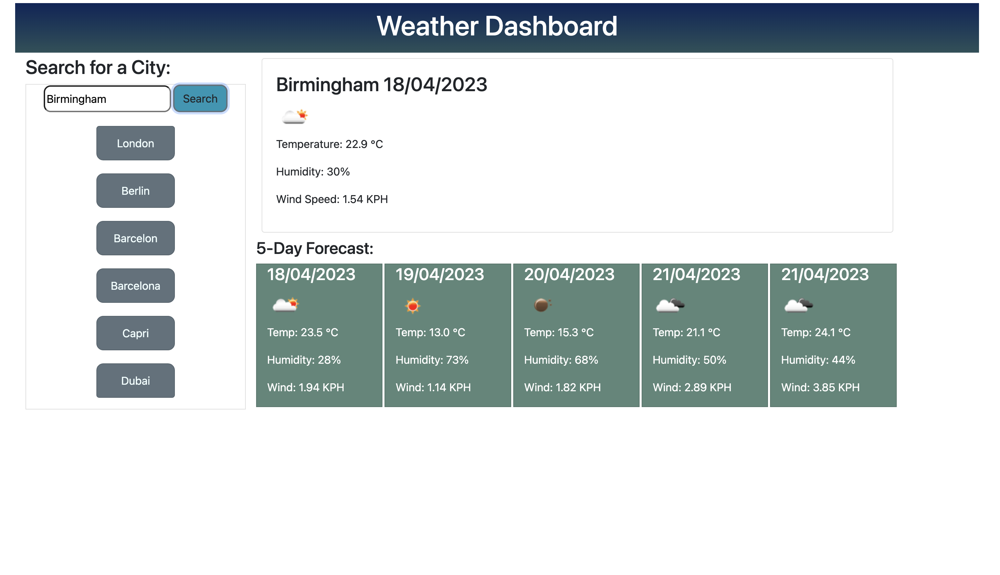

# Server-APIs-Weather-Dashboard
Bootcamp: UBHM_Module 8 Challenge
<!--User Stoyr-->
AS A traveler
I WANT to see the weather outlook for multiple cities
SO THAT I can plan a trip accordingly
<!--Why did you build this project? (Note: the answer is not "Because it was a homework assignment.")-->
- I created this basic dashboard to practice the use of APIs and AJAX calls to get data, provided from different sources/applications.
<!--What problem does it solve?-->
- This basic Weather Dashboard, presents the current and future weather conditions for the user's requested city, and the city will kept add to the search    history.

## Installation

This application run in the browser, so no installation needed.

## Usage

1. Search bar is displayed on the screen.
2. Search for a city using the mentioned bar.
3. Today's weather is displayed at the top right hand side of the screen.
4. Below, we can see the weather information for the following 5 days
5. Cities' search history is shown on the left side of the screen.

## Credits

- Karla Fuentes Guerrero: https://github.com/KarlaFuGue
- Design: https://getbootstrap.com/docs/4.6/getting-started/introduction/
- Weather API: https://openweathermap.org/api

## License

MIT License

Copyright (c) [2023] [KarlaFuentesGuerrero]

## Languages & Sources
- HTML
- CSS
- JS
- Jquery
- Bootstrap
- API
- Moment js
- Adobe color